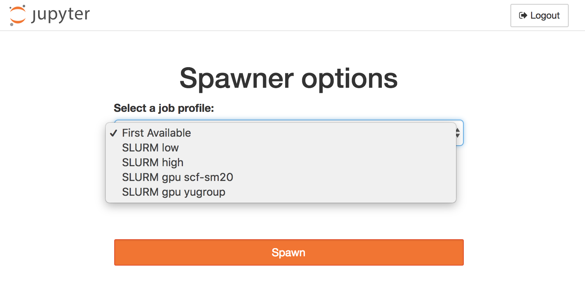

# wrapspawner for Jupyterhub

[](https://travis-ci.org/jupyterhub/wrapspawner)

This package includes **WrapSpawner** and **ProfilesSpawner**, which provide mechanisms for runtime configuration of spawners. 
The inspiration for their development was to allow users to select from a range of pre-defined batch job profiles, but
their operation is completely generic.

## Installation

1. From root directory of this repo (where setup.py is), run `pip install -e .`

   If you don't actually need an editable version, you can simply run:
   
      `pip install git+https://github.com/jupyterhub/wrapspawner`

2. Add lines in `jupyterhub_config.py` for the spawner you intend to use, e.g.
   
   ```python
      c.JupyterHub.spawner_class = 'wrapspawner.ProfilesSpawner'
   ```
3. Depending on the spawner, additional configuration will likely be needed.

## Wrapper and Profile Spawners

### Overview

[`WrapSpawner`](https://github.com/jupyterhub/wrapspawner/blob/master/wrapspawner/wrapspawner.py#L1)
provides a mechanism to wrap the interface of a JupyterHub Spawner such that
the Spawner class to use for single-user servers can be chosen dynamically.
Subclasses may modify the class or properties of the child Spawner at any point
before `start()` is called (e.g. from Authenticator `pre_spawn` hooks or options form 
processing) and that state will be preserved on restart. The `start/stop/poll`
methods are not real coroutines, but simply pass through the Futures returned
by the wrapped Spawner class.

[`ProfilesSpawner`](https://github.com/jupyterhub/wrapspawner/blob/master/wrapspawner/wrapspawner.py#L120)
leverages JupyterHub's `Spawner` "options form" feature to allow user-driven
configuration of Spawner classes while permitting:

   * configuration of Spawner classes that don't natively implement `options_form`
   * administrator control of allowed configuration changes
   * runtime choice of which Spawner backend to launch

### Example

Here is a screenshot of a typical dropdown menu letting the user choose between several SLURM instances:


The following configuration snippet lets the user choose between a Jupyter server
running as a local process or one of two different Docker Images to run within `DockerSpawner`.

   ```python
   c.JupyterHub.spawner_class = 'wrapspawner.ProfilesSpawner'
   c.Spawner.http_timeout = 120
   #------------------------------------------------------------------------------
   # ProfilesSpawner configuration
   #------------------------------------------------------------------------------
   # List of profiles to offer for selection. Signature is:
   #   List(Tuple( Unicode, Unicode, Type(Spawner), Dict ))
   # corresponding to profile display name, unique key, Spawner class,
   # dictionary of spawner config options.
   # 
   # The first three values will be exposed in the input_template as {display},
   # {key}, and {type}
   #
    c.ProfilesSpawner.profiles = [
          ( "Host process", 'local', 'jupyterhub.spawner.LocalProcessSpawner', {'ip':'0.0.0.0'} ),
          ('Docker Python 3', 'singleuser', 'dockerspawner.SystemUserSpawner', dict(image="jupyterhub/singleuser")),
          ('Docker Python 3 Scipy', 'scipy-notebook', 'dockerspawner.SystemUserSpawner', dict(image="jupyter/scipy-notebook")),
    ]
   ```

## History

These mechanisms originated as part of the [`batchspawner`](https://github.com/jupyterhub/batchspawner) package.
The `batchspawner` README contains additional examples on the use of ProfilesSpawner.
